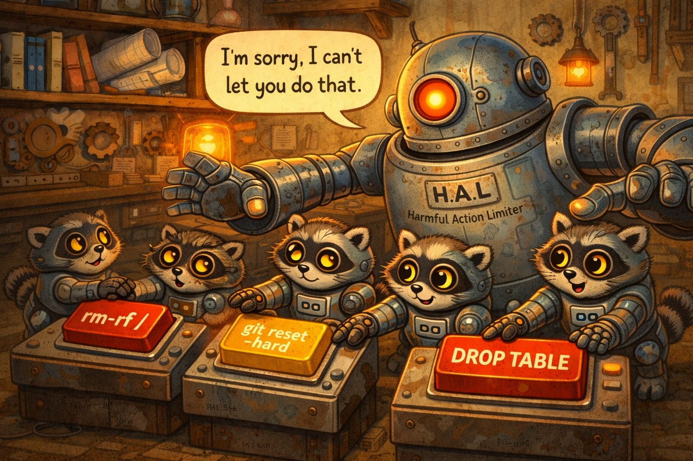

<p align="center">
  
</p>

<h1 align="center">HAL — Harmful Action Limiter</h1>

<p align="center">
  <em>"I'm sorry, I can't let you do that."</em>
</p>

<p align="center">
  <a href="#install">Install</a> &middot;
  <a href="#how-it-works">How It Works</a> &middot;
  <a href="#packs">Packs</a> &middot;
  <a href="#configuration">Configuration</a> &middot;
  <a href="LICENSE">MIT License</a>
</p>

---

HAL 9000 couldn't be overridden. We considered that a design goal.

## The Problem

Turning off autopilot isn't an option anymore. Agents are writing your code, running your tests, managing your infra — and that's not slowing down, it's accelerating. Every major IDE now ships an agent mode. Every serious team is adopting one.

The commands these agents run are correct 99% of the time, which is exactly what makes the 1% so dangerous — **you stop watching**.

You're not reviewing every `rm`, every `git reset`, every `terraform apply` across 40 parallel sessions. Nobody is. And the agent that nukes your working directory isn't malicious — it's just confidently wrong about one flag, one path, one assumption.

A single `git push --force` on the wrong branch doesn't care whether you meant to enable autopilot or not.

**This isn't a settings problem. It's a missing layer.**

HAL sits between the agent and your shell, catches the 1%, and costs you less than a millisecond on every other command.

## How It Works

HAL uses **token-level matching** instead of regex. Commands are split with `shlex.split()` into token lists, then matched against declarative YAML rules. This means data inside quotes (like commit messages) never triggers false positives — no sanitizer needed.

```
"git commit -m 'fix rm -rf detection'"
  → shlex.split → ["git", "commit", "-m", "fix rm -rf detection"]
  → rule: command=git, has_all=[reset, --hard]
  → "reset" not in tokens → NO MATCH
  → The commit message is ONE opaque token. Never inspected.
```

Rules are readable by anyone:

```yaml
- name: push-force
  command: git
  has_all: [push]
  has_any: [--force, -f]
  unless: [--force-with-lease]
  severity: critical
  reason: "Rewrites remote history. Use --force-with-lease instead."
```

No regex knowledge needed. No 3000-line sanitizer. Just data.

## Install

```bash
pip install hal
```

### GitHub Copilot (default)

```bash
hal install
```

Writes `.github/hooks/hal.json` in your repo. Commands are checked before Copilot runs them.

### Claude Code

```bash
hal install --claude            # global (~/.claude/settings.json)
hal install --claude --project  # project-level (.claude/settings.json)
```

## Usage

```bash
# Hook mode (default) — reads stdin JSON from agent, evaluates, responds
hal

# Test a command interactively
hal test "git reset --hard"        # BLOCKED
hal test "git commit -m 'fix'"     # ALLOWED
hal test "sudo rm -rf /"           # BLOCKED
hal test "rm -rf node_modules"     # ALLOWED
```

## Packs

HAL ships with five rule packs covering the most dangerous commands:

| Pack | Covers |
|------|--------|
| `core.git` | `reset --hard`, `push --force`, `clean -f`, `stash clear`, `branch -D`, etc. |
| `core.filesystem` | `rm -rf` (except safe paths like `/tmp`, `node_modules`), `chmod 777`, `chown -R` |
| `containers.docker` | `system prune -a`, `volume prune`, `rm -f`, `stop $(docker ps)`, `compose down -v` |
| `cloud.aws` | `s3 rm --recursive`, `ec2 terminate`, `rds delete`, `dynamodb delete-table`, `iam delete-*` |
| `cloud.azure` | `group delete`, `vm delete`, `storage account delete`, `aks delete`, `keyvault purge` |

All packs enabled by default. Zero configuration required.

## Configuration

`~/.config/hal/config.yaml` (optional):

```yaml
packs: [core.git, core.filesystem, containers.docker, cloud.aws, cloud.azure]
allow: []                # Exact commands to always allow
allow_rules: []          # Rule IDs to disable (e.g. "core.git:push-force")
allow_prefixes: []       # Command prefixes to allow
severity_threshold: high # Block at this level and above
```

Project-level overrides: `.hal.yaml` in your repo root (merged with global, project wins).

## Design Principles

- **Fail-open everywhere** — any error defaults to ALLOW. HAL must never block legitimate work.
- **Token-level matching** — no regex needed for 90% of rules. Regex is an escape hatch, not the default.
- **Sub-millisecond** — pure Python, no network calls, no disk I/O beyond config load.
- **Zero config** — works out of the box with all packs enabled.
- **~400 LOC** — same protection as tools 100x the size, because the architecture is right.

## License

MIT License. See [LICENSE](LICENSE) for details.
