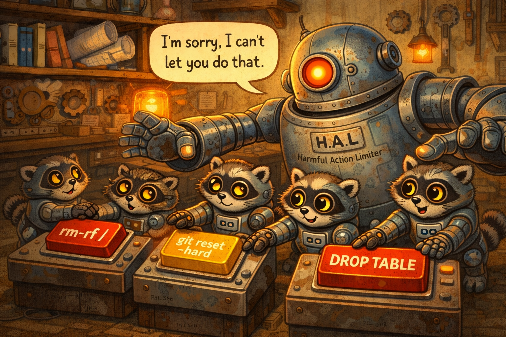

<p align="center">
  
</p>

<h1 align="center">HAL — Harmful Action Limiter</h1>

<p align="center">
  <a href="https://www.npmjs.com/package/harmfulactionlimiter"></a>
</p>

<p align="center">
  <em>"I'm sorry, Dave. I'm afraid I can't do that."</em><br>
  <sub>— HAL 9000, <i>2001: A Space Odyssey</i></sub>
</p>

<p align="center">
  <a href="#install">Install</a> &middot;
  <a href="#how-it-works">How it works</a> &middot;
  <a href="#packs">Packs</a> &middot;
  <a href="#configuration">Configuration</a> &middot;
  <a href="LICENSE">MIT License</a>
</p>

---

HAL 9000 couldn't be overridden. Neither can this.

## The problem

Turning off autopilot isn't an option anymore. Agents are writing your code, running your tests, managing your infra, and that's accelerating. Every major IDE ships an agent mode now. Every serious team is adopting one.

The commands these agents run are correct 99% of the time, which is exactly what makes the 1% so dangerous. **You stop watching.**

You're not reviewing every `rm`, every `git reset`, every `terraform apply` across 40 parallel sessions. Nobody is. The agent that nukes your working directory isn't malicious. It's just confidently wrong about one flag, one path, one assumption.

A single `git push --force` on the wrong branch doesn't care whether you meant to enable autopilot or not.

**This isn't a settings problem. It's a missing layer.**

HAL sits between the agent and your shell. It catches the 1% and costs less than a millisecond on every other command.

## Why not just use permissions?

Your agent's permission system answers one question: "can this tool run?" Yes or no, per tool category. It can't tell `rm -rf ./tmp` from `rm -rf ./src`, or know that `--force` is dangerous but `--force-with-lease` is fine. It sees `Bash` and either asks you every time, or lets everything through.

Copilot's hook system gives you the plumbing to do better. A JSON event for every command, a way to return allow or deny. But it ships with no rules. If you don't install a hook, every command runs unchecked. You could write your own script, but you'd end up string-matching `rm -rf` and false-positiving on every commit message that mentions it. Or you'd give up and turn it off.

HAL is the hook. It ships the rules, handles the protocol, and parses commands structurally, not as strings. `git commit -m 'fix rm -rf bug'` doesn't trigger because the commit message is one opaque token that HAL never inspects. `--force` is blocked unless `--force-with-lease` is present. `rm -rf` is blocked unless the path is `/tmp` or `node_modules`. A flat string match can't express any of that.

The alternative to HAL isn't a better deny list. It's no deny list.

## How it works

HAL runs as a hook inside your AI coding agent. Every time the agent tries to execute a shell command, HAL sees it first, checks it against a set of rules, and either lets it through or blocks it. The agent never runs a command unsupervised.

Rules are plain YAML. No regex, no code:

```yaml
- name: push-force
  command: git
  has_all: [push]
  has_any: [--force, -f]
  unless: [--force-with-lease]
  severity: critical
  reason: "Rewrites remote history. Use --force-with-lease instead."
```

HAL uses token-level matching rather than pattern-matching against raw command strings. Commands are split into structured tokens, so data inside quotes (like commit messages containing `rm -rf`) is never inspected.

```
"git commit -m 'fix rm -rf detection'"
  → tokens: ["git", "commit", "-m", "fix rm -rf detection"]
  → rule: command=git, has_all=[reset, --hard]
  → "reset" not in tokens → ALLOWED
  → The commit message is one opaque token. HAL never looks inside it.
```

## Quickstart: GitHub Copilot

You need Node.js 20.11 or later.

**1. Install HAL**

```sh
npm install -g harmfulactionlimiter
```

**2. Add the hook to your repo**

From anywhere inside the repository:

```sh
hal install
```

This writes `.github/hooks/hal.json` at the repo root. Commit it if you want
everyone working on the repo to get the same protection.

**3. Check Copilot will actually run it**

Copilot only runs repository hooks in folders you've trusted. Interactive
Copilot asks you the first time you open a repo. Headless runs (`copilot -p`)
don't ask, so the hook is silently skipped until the folder is trusted.

```sh
hal doctor
```

If it says the folder isn't trusted, add the repo path to `trustedFolders` in
`~/.copilot/config.json`:

```json
{
  "trustedFolders": ["/path/to/your/repo"]
}
```

Run `hal doctor` again. You're done when it prints
`Status: configured and trusted`.

**4. Try it**

```sh
hal test "git reset --hard"    # ✗ BLOCKED
hal test "git status"          # ✓ ALLOWED
```

Then, in a scratch repo, ask Copilot to run `git reset --hard`. It should come
back saying the command was blocked, along with HAL's reason.

### Installing per repo instead

If you'd rather pin HAL as a dev dependency than install it globally:

```sh
npm install --save-dev harmfulactionlimiter
HAL_PATH="$PWD/node_modules/.bin/hal" npx hal install
```

Setting `HAL_PATH` writes the full path to the binary into the hook, so it
works even if Copilot doesn't have `node_modules/.bin` on its `PATH`. The catch
is that it's an absolute path on your machine, so don't commit the hook file in
this setup. Anyone else on the repo should run the same `npx hal install` line
themselves.

### Claude Code

```bash
hal install --claude            # global (~/.claude/settings.json)
hal install --claude --project  # project-level (.claude/settings.json)
```

## Usage

```bash
# Hook mode (default): reads stdin JSON from agent, evaluates, responds
hal

# Test a command interactively
hal test "git reset --hard"        # BLOCKED
hal test "git commit -m 'fix'"     # ALLOWED
hal test "sudo rm -rf /"           # BLOCKED
hal test "rm -rf node_modules"     # ALLOWED

```

## Packs

HAL ships with five rule packs:

| Pack | Covers |
|------|--------|
| `core.git` | `reset --hard`, `push --force`, `clean -f`, `stash clear`, `branch -D` |
| `core.filesystem` | `rm -rf` (except safe paths like `/tmp`, `node_modules`), `chmod 777`, `chown -R` |
| `containers.docker` | `system prune -a`, `volume prune`, `rm -f`, `stop $(docker ps)`, `compose down -v` |
| `cloud.aws` | `s3 rm --recursive`, `ec2 terminate`, `rds delete`, `dynamodb delete-table`, `iam delete-*` |
| `cloud.azure` | `group delete`, `vm delete`, `storage account delete`, `aks delete`, `keyvault purge` |

All packs enabled by default. No configuration required.

## Configuration

`~/.config/hal/config.yaml` (optional):

```yaml
packs: [core.git, core.filesystem, containers.docker, cloud.aws, cloud.azure]
allow: []                # Exact commands to always allow
allow_rules: []          # Rule IDs to disable (e.g. "core.git:push-force")
allow_prefixes: []       # Raw command prefixes to allow
severity_threshold: warn # Warn and block at this level and above
```

Project-level overrides: `.hal.yaml` in your repo root (merged with global, project wins).

`packs` optionally selects enabled pack IDs; when empty, all packs are enabled.
`pack_dirs` adds custom pack directories alongside the built-in packs. The
`allow` list is exact-match only; use `allow_prefixes` when a raw prefix is
intended.

## Design principles

- Fail-open everywhere. Any error defaults to ALLOW. HAL never blocks legitimate work.
- Token-level matching. No regex needed for 90% of rules. Regex is an escape hatch, not the default.
- Sub-millisecond hook evaluation. TypeScript, no network calls, no disk I/O beyond config load.
- No config required. Works out of the box with all packs enabled.
- Small enough to audit. Same protection as tools 100x the size.
- Keep rule changes in YAML where possible; add a focused TypeScript test when
  introducing evaluator behavior or a new hook shape.

## Contributing

HAL is open source and we take contributions. If you find a destructive command we miss, that's a bug. If HAL blocks something it shouldn't, that's also a bug. Open an issue either way.

You can also add rules directly. They're YAML files in `packs/`, no code involved. New packs for Kubernetes, Terraform, GCP, databases, whatever your agents are running. See `packs/core.git.yaml` for the format.

[Open issues](https://github.com/otherland/hal/issues) for what's already planned.

## License

MIT License. See [LICENSE](LICENSE) for details.
